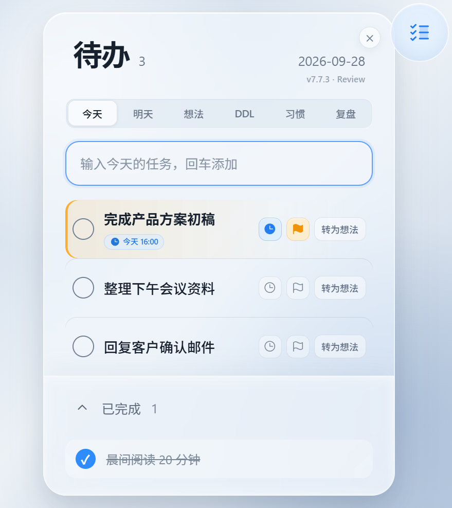
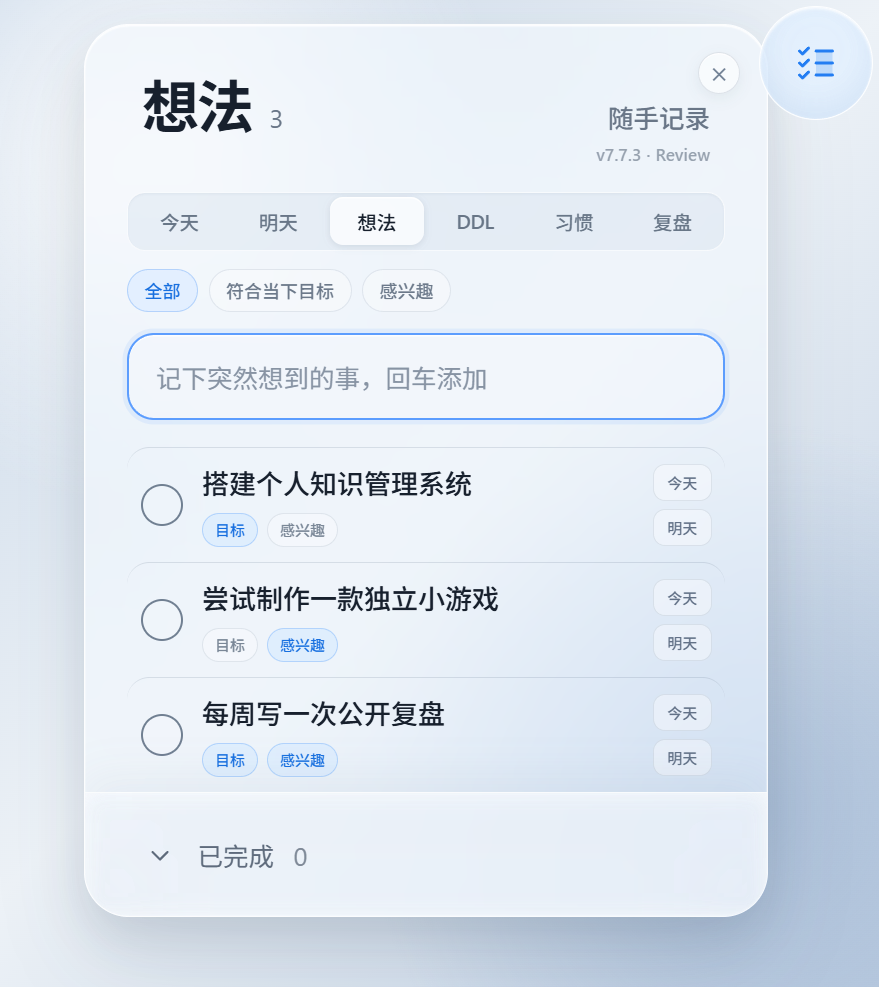
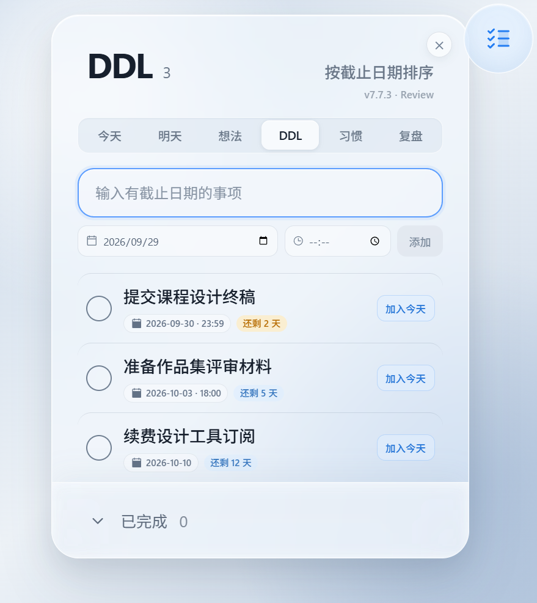
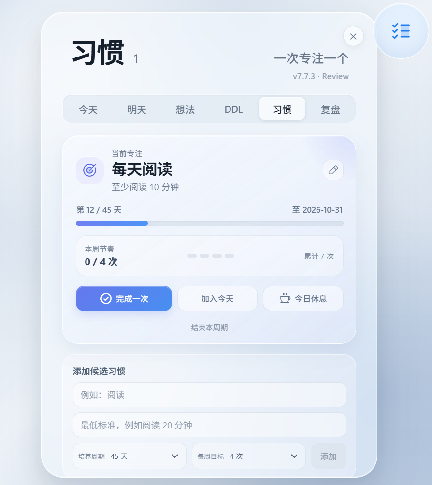
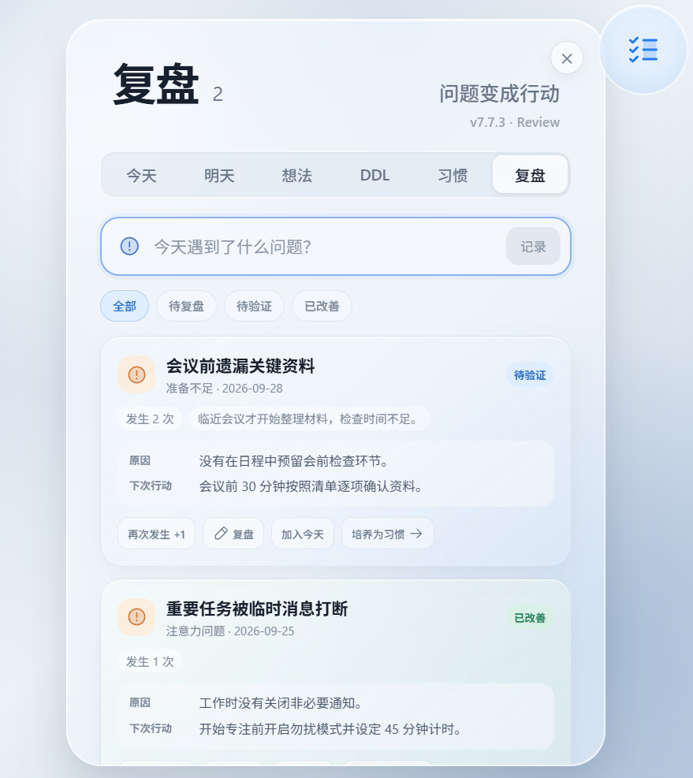

# GlassTodo

GlassTodo 是一个极简的 Windows 桌面待办小工具。它平时以可拖动的小圆球停留在桌面上，点击后展开毛玻璃待办面板，适合随手记录今天、明天和突然冒出的想法。

## 功能预览

### 今日待办

快速记录任务，为重要事项设置标记和提醒时间，完成后自动收进“已完成”。右上角的小圆球可以随时拖动或展开面板。



| 想法管理 | DDL 截止任务 |
| --- | --- |
| 将突然出现的念头按“符合当下目标”和“感兴趣”分类。 | 记录截止日期与时间，并按临近程度自动排序。 |
|  |  |

| 习惯培养 | 问题复盘 |
| --- | --- |
| 一次聚焦一个习惯，记录每日行动和阶段进度。 | 记录问题、原因和改进行动，并跟踪验证状态。 |
|  |  |

## 功能

- 桌面悬浮小圆球，支持拖动与点击展开
- 简约的 Apple 风格透明毛玻璃界面
- 今日待办、明日待办与“想法”列表
- 新增待办默认显示在列表最前面
- 想法支持“全部 / 符合当下目标 / 感兴趣”分类，可重新安排到今天或明天
- 旧版“未完成”数据会自动迁移到想法的“全部”分类
- DDL 列表记录截止日期与时间，并按临近程度排序
- 单条今日待办支持设置提醒时间和重要标记
- 习惯模块支持一次聚焦一个长期习惯、每日打卡与阶段进度
- 复盘模块记录问题、原因、改进行动和验证状态，并可转为今日待办或候选习惯
- 勾选完成后自动下沉到“已完成”区域
- 每 30 分钟提醒查看今日待办
- 本地 JSON 数据持久化，升级版本不会主动清空任务
- 使用同一账号在电脑和手机之间自动同步，并保留离线编辑能力
- 首次连接云端前自动创建本地数据备份；同步按单条任务合并，不整份覆盖
- 手机网页支持安装到主屏幕，以独立 PWA 方式运行
- 一键创建桌面启动快捷方式
- 面板内提供关闭程序按钮

## 下载与使用

前往仓库的 **Releases** 页面下载 Windows 版本，解压后运行 `GlassTodo.exe`。

任务数据默认保存在：

```text
%APPDATA%\glasstodo\tasks.json
```

提醒功能需要 GlassTodo 保持运行。

## 本地开发

需要 Node.js 20 或更高版本。

```bash
npm install
npm run dev
```

运行桌面版：

```bash
npm run desktop
```

构建 Windows 便携版：

```bash
npm run dist:win
```

## 云同步配置

1. 在 Supabase 新建项目。
2. 在 SQL Editor 运行 [`supabase/schema.sql`](supabase/schema.sql)。
3. 复制 `.env.example` 为 `.env.local`，填写项目 URL 和 Publishable Key。
4. 在 Supabase Authentication 中启用邮箱密码登录。小范围测试可关闭强制邮箱确认；正式公开时应配置自有 SMTP。
5. 重新运行 `npm run build` 或 `npm run dist:win`，云端配置会在构建时写入客户端。

只能在客户端使用 Publishable Key（旧项目中也叫 anon key），绝不能把 `service_role` key 放进代码、安装包或 GitHub。

同步数据表开启了 Row Level Security，每个账号只能读取和修改自己的任务。首次登录会先将当前任务备份，再把本机和云端记录合并。桌面备份位于：

```text
%APPDATA%\glasstodo\backups\tasks-before-cloud-*.json
```

## 数据与隐私

未登录时，GlassTodo 的待办内容仍只保存在本机。用户主动登录云同步后，任务会传输到所配置的 Supabase 项目，并同时保留本地副本。公开仓库与 Release 安装包不包含作者的个人任务数据。
